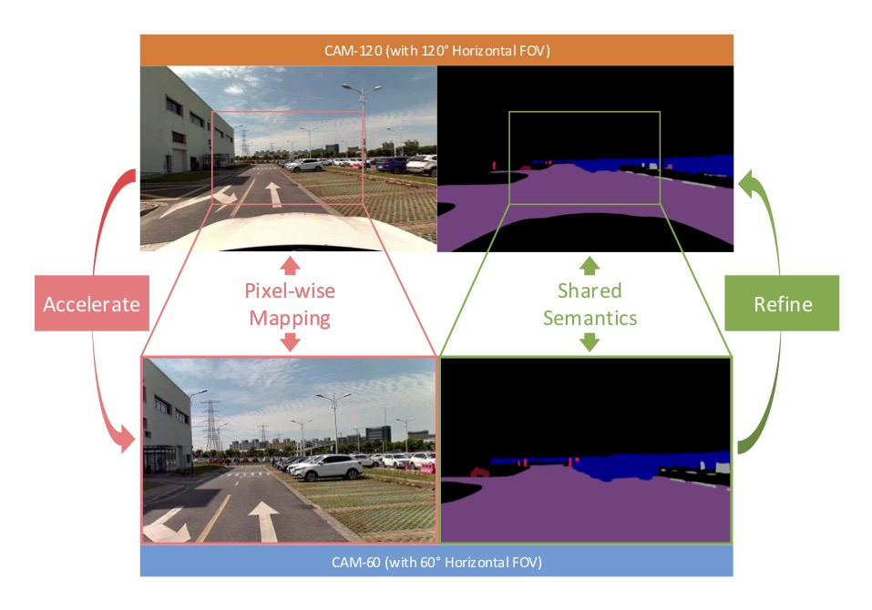
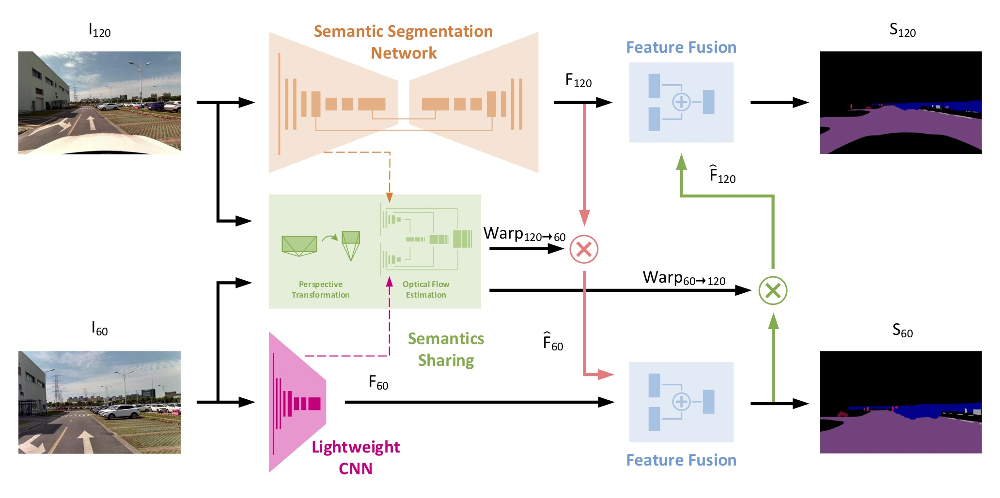
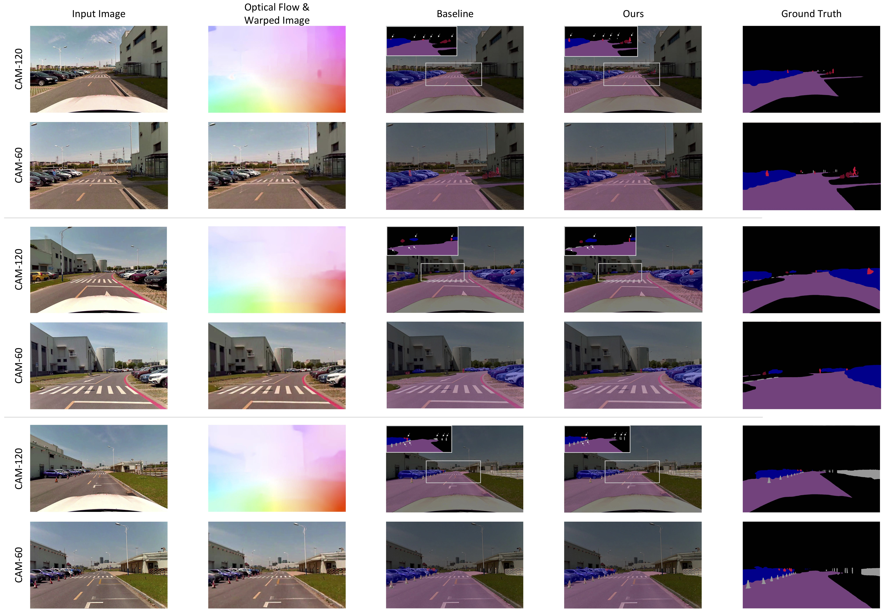

# Semantics Sharing

This repository is the offical release for the paper <a href="https://arxiv.org/pdf/1909.07038.pdf"><strong>Boosting Real-Time Driving Scene Parsing with Shared Semantics</strong></a>. The video introducing the paper is available <a href="https://youtu.be/Od1WVaqqt1o">here</a>.

In this paper, we proposed a deep neural network for real-time scene parsing which leverages shared semantics between cameras with different perspectives and overlapped views. Compared with traditional approaches, our method mainly boosts the scene parsing task for multi-camera systems in the following two aspects: 1) reduce the computation load for cameras with narrower field of views (FoVs), and 2) improve the scene parsing quality for cameras with broader FoVs.

<p align="center">

</p>

## Network Architecture


## Requirements
- Python 3.6
- PyTorch 1.2
- spatial-correlation-sampler
- kornia

## Dataset
- image pairs

  The dataset consists of image pairs from the cameras with 60 degree horizontal FoV and 120 degree horizontal FoV. The format of the file names should following the example images in the [data/image_train](data/image_train) folder: **fov60_00001** & **fov120_00001**.

  Note that the number of the same frame must be the same. If more images are added, please increase the index number in the file name.

- label

  The category that is not included in the loss is labeled -1.

## Train
Run the train script with different models and fix some corresponding modules:
```
python3 train.py --model-mode [MODEL_NAME] \
    		     --fixed_mobilenetv3 [True] --fixed_pwcnet [True] --fixed_FFM120 [False] --fixed_FFM60 [True]
```
The ``[MODEL_NAME]`` can be chosen from: mobilenetv3, mobilenetv3_loosely, mobilenetv3_tightly. More training details and parameters setting can be found in the paper.

## Evaluate
Run the eval script with different models and corresponding model path:
```
python3 train.py --model-mode [MODEL_NAME] --resume [MODEL_PATH] --save-pre-path [SAVING_PATH] --combined [False]
```
The ``[SAVING_PATH]``is the path to save the inference results of the validation set. The form of the results is determined by the parameter **--combined**. If it is *True*, the output will consist of four RGB images.
## Test

With the provided trained models, please follow the usages below to perform the testing:

- Prepare image data and model files

  The example input images are provided in the [data/image_test](data/image_test) folder.

  The trained models can be downloaded from the following links: [[mobilenetv3](https://drive.google.com/file/d/1j2oiqkg9MfzeaGTF_8AO1Trzle4Xpmhm/view?usp=sharing)], [[loosely-coupled](https://drive.google.com/file/d/15hulONRoEEUrMIJ0BCpG6b_VYxA1TRDI/view?usp=sharing)], [[tightly-coupled](https://drive.google.com/file/d/1U28ceVAHXq9p5wZyozZuc5cWIrFj1I4Q/view?usp=sharing)]. The models should be put in the [scripts/checkpoint](scripts/checkpoint) folder for testing.

- Inference

  Run the test script with different models and corresponding PyTorch model files:
  ```
  python3 test.py --model-mode [MODEL_NAME] --resume [MODEL_PATH]
  ```


- Comparisons




## License and Citation
All code and other materials (including but not limited to the paper, figures, and tables) are provided for research purposes only and without any warranty. Any commercial use requires our consent. When using any parts of the code package or the paper (<i>Boosting Real-Time Driving Scene Parsing with Shared Semantics</i>) in your work, please cite the following paper:

```
@misc{xiang2019boosting,
    title={Boosting Real-Time Driving Scene Parsing with Shared Semantics},
    author={Zhenzhen Xiang and Anbo Bao and Jie Li and Jianbo Su},
    year={2019},
    eprint={1909.07038},
    archivePrefix={arXiv},
    primaryClass={cs.CV}
}
```
## References

- <a href="http://openaccess.thecvf.com/content_ICCV_2019/papers/Howard_Searching_for_MobileNetV3_ICCV_2019_paper.pdf">MobileNetV3</a>:
    ```
    @InProceedings{Howard_2019_ICCV,
        author = {Howard, Andrew and Sandler, Mark and Chu, Grace and Chen, Liang-Chieh and Chen, Bo and Tan, Mingxing and Wang, Weijun and Zhu, Yukun and Pang, Ruoming and Vasudevan, Vijay and Le, Quoc V. and Adam, Hartwig},
        title = {Searching for MobileNetV3},
        booktitle = {The IEEE International Conference on Computer Vision (ICCV)},
        year = {2019}
    }
    ```

- <a href="http://openaccess.thecvf.com/content_cvpr_2018/papers/Sun_PWC-Net_CNNs_for_CVPR_2018_paper.pdf">PWC-Net</a>:
    ```
    @InProceedings{Sun2018PWC-Net,
        author = {Deqing Sun and Xiaodong Yang and Ming-Yu Liu and Jan Kautz},
        title = {{PWC-Net}: {CNNs} for Optical Flow Using Pyramid, Warping, and Cost Volume},
        booktitle = {The IEEE Conference on Computer Vision and Pattern Recognition (CVPR)},
        year = {2018}
    }
    ```

## Acknowledgments
- [Tramac/Lightweight-Segmentation](https://github.com/Tramac/Lightweight-Segmentation): MobileNetV3 for semantic segmentation.
- [RanhaoKang/PWC-Net_pytorch](https://github.com/RanhaoKang/PWC-Net_pytorch): optical flow estimation.
- [ClementPinard/Pytorch-Correlation-extension](https://github.com/ClementPinard/Pytorch-Correlation-extension): PyTorch implementation of Corrleation Module.
- [nianticlabs/monodepth2](https://github.com/nianticlabs/monodepth2): unsupervised losses.
- [kornia/kornia](https://github.com/kornia/kornia): PyTorch implementation of homography warping.

## Contact
Zhenzhen Xiang (wwfzs1990@gmail.com), Anbo Bao (ab_bao@sjtu.edu.cn)
