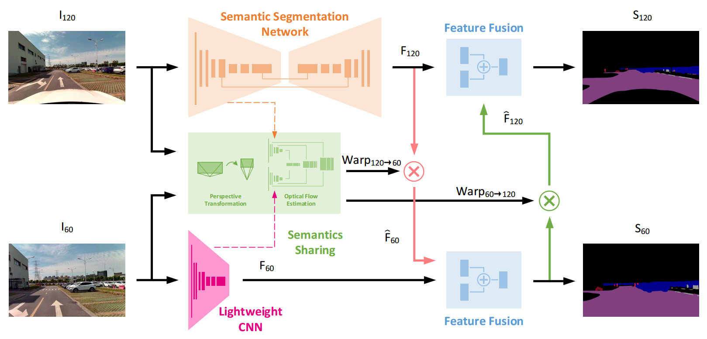

# Semantics Sharing

This repository is the offical release for the paper <a href="https://arxiv.org/pdf/1909.07038.pdf"><strong>Boosting Real-Time Driving Scene Parsing with Shared Semantics</strong></a>.

## Network Architecture

## Requirements
- Python 3.7
- PyTorch 1.2
- spatial-correlation-sampler
- kornia

## Testing

With the provided pre-trained models, please follow the usages below to perform the testing:

<!-- - Baseline
  
  Run the testing script: -->

- Ours
  
  Run the testing script:
  <pre><code>python3 test.py
  </code></pre>

## Training

### Pre-training

1. For the pre-training of semantic segmentation, please refer to [pre_train/semantic_segmentation/README.md](pre_train/semantic_segmentation/README.md).
2. For the pre-training of optical flow, please refer to [pre_train/optical_flow/README.md](pre_train/optical_flow/README.md).
3. For the pre-training of feature fusion module ...

### Training the whole network

1. Prepare the datasets ...
2. Run the training script ...

## License and Citation 
All code and other materials (including but not limited to the paper, figures, and tables) are provided for research purposes only and without any warranty. Any commercial use requires our consent. When using any parts of the code package or the paper (<i>Boosting Driving Scene Parsing with Shared Semantics</i>) in your work, please cite the following paper:

<pre><code>@misc{xiang2019boosting,
    title={Boosting Real-Time Driving Scene Parsing with Shared Semantics},
    author={Zhenzhen Xiang and Anbo Bao and Jie Li and Jianbo Su},
    year={2019},
    eprint={1909.07038},
    archivePrefix={arXiv},
    primaryClass={cs.CV}
}</code></pre>

## References

- <a href="http://openaccess.thecvf.com/content_ICCV_2019/papers/Howard_Searching_for_MobileNetV3_ICCV_2019_paper.pdf">MobileNetV3</a>:
    <pre><code>@InProceedings{Howard_2019_ICCV,
    author = {Howard, Andrew and Sandler, Mark and Chu, Grace and Chen, Liang-Chieh and Chen, Bo and Tan, Mingxing and Wang, Weijun and Zhu, Yukun and Pang, Ruoming and Vasudevan, Vijay and Le, Quoc V. and Adam, Hartwig},
    title = {Searching for MobileNetV3},
    booktitle = {The IEEE International Conference on Computer Vision (ICCV)},
    year = {2019}
    }</code></pre>

- <a href="http://openaccess.thecvf.com/content_cvpr_2018/papers/Sun_PWC-Net_CNNs_for_CVPR_2018_paper.pdf">PWC-Net</a>:
    <pre><code>@InProceedings{Sun2018PWC-Net,
    author = {Deqing Sun and Xiaodong Yang and Ming-Yu Liu and Jan Kautz},
    title = {{PWC-Net}: {CNNs} for Optical Flow Using Pyramid, Warping, and Cost Volume},
    booktitle = {The IEEE Conference on Computer Vision and Pattern Recognition (CVPR)},
    year = {2018}
    }</code></pre>

## Acknowledgments
- [Tramac/Lightweight-Segmentation](https://github.com/Tramac/Lightweight-Segmentation): MobileNetV3 for semantic segmentation.
- [RanhaoKang/PWC-Net_pytorch](https://github.com/RanhaoKang/PWC-Net_pytorch): optical flow estimation.
- [ClementPinard/Pytorch-Correlation-extension](https://github.com/ClementPinard/Pytorch-Correlation-extension): PyTorch implementation of Corrleation Module.
- [kornia/kornia](https://github.com/kornia/kornia): PyTorch implementation of homography warping.

## Contact
Zhenzhen Xiang (wwfzs1990@gmail.com)
